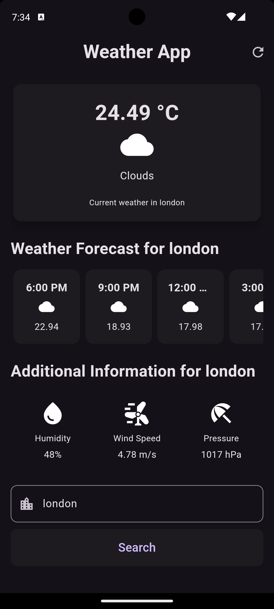

# Weather App 🌦️

A Flutter application that provides current weather information and forecasts for various cities. The app allows users to search for weather details by city name and displays weather conditions, including temperature, humidity, wind speed, and more.

## Features

- 🌡️ Display current weather information for a specified city.
- 📅 Provides a 5-day weather forecast with detailed hourly updates.
- 💧 Shows additional weather information such as humidity, wind speed, and pressure.
- 🔄 Refresh weather data with a simple tap.
- 🔍 Search for any city's weather using the search input.

## Screenshots



## Getting Started

### Prerequisites

- **Flutter SDK**: Ensure that Flutter is installed on your machine. You can install it from the [official Flutter website](https://flutter.dev/docs/get-started/install).

### Installation

1. **Clone the repository**:

   ```bash
   git clone https://github.com/yourusername/weather_app.git
   cd weather_app
   ```

2. **Install dependencies**:

   ```bash
   flutter pub get
   ```

3. **Run the app**:
   ```bash
   flutter run
   ```

### Usage

1. **Enter a city name**: Type the name of the city you want to check the weather for in the input field.
2. **Search**: Press the "Search" button to retrieve and display the weather information for the specified city.
3. **Refresh**: Use the refresh button in the app bar to reload the weather data.

## Project Structure

```
├── lib
│   ├── assets
│   │   └── image.png
│   ├── main.dart
│   ├── widget
│   │   ├── add_info.dart
│   │   └── forecast.dart
│   └── screens
│       └── weather_app_home.dart
├── pubspec.yaml
└── README.md
```

## Dependencies

- [http](https://pub.dev/packages/http): For making HTTP requests to fetch weather data.
- [intl](https://pub.dev/packages/intl): For formatting dates and times.
- [flutter](https://flutter.dev/): The Flutter framework.

## API

This app uses the [OpenWeatherMap API](https://openweathermap.org/api) to fetch weather data. You will need to add your own API key in the `getCurrentWeather` method in `weather_app_home.dart`.

```dart
final res = await http.get(Uri.parse(
    'https://api.openweathermap.org/data/2.5/forecast?q=$city&appid=YOUR_API_KEY_HERE'));
```

## Contributing

Contributions are welcome! Please fork the repository and create a pull request with your changes. Ensure that your code follows the project's coding style and passes all tests.

---

_Created by Md Siamul Islam Soaib_
